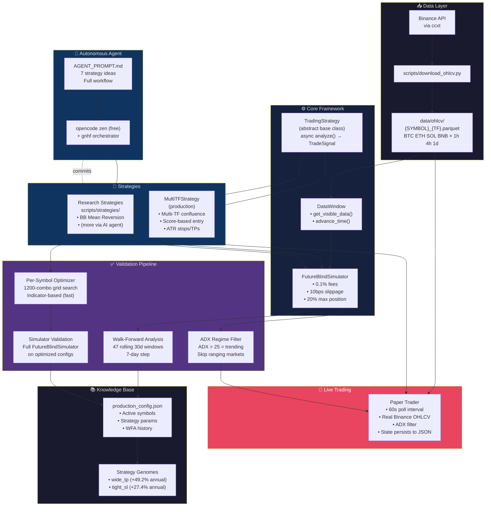
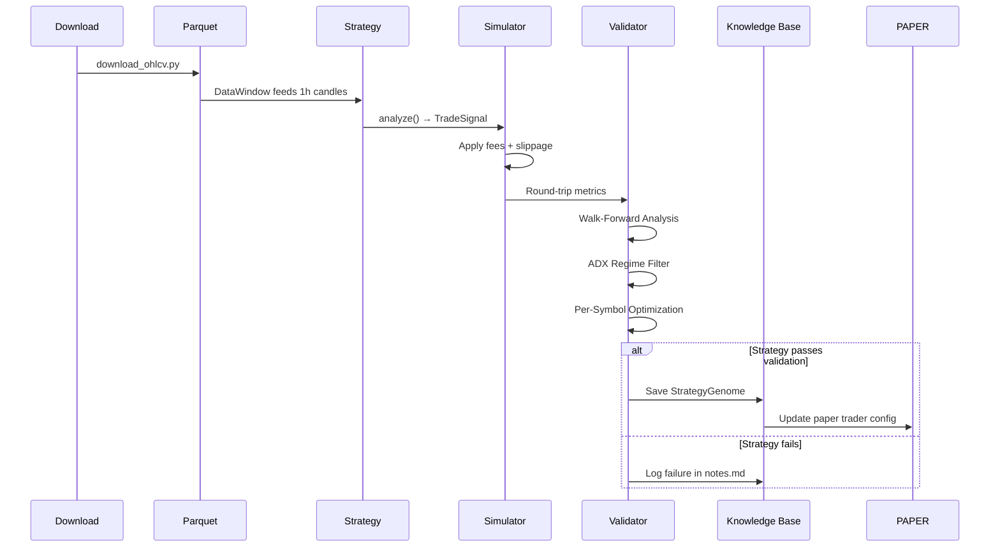

# Crypto Swarm Trader — Architecture

## Overview

A crypto backtesting and paper trading system with automated strategy research.
Uses multi-timeframe confluence analysis on hourly Binance data with walk-forward
validation to avoid overfitting.

## Directory Structure

```
crypto-swarm-trader/
├── backtesting/              # Core simulation framework
│   ├── future_blind_simulator.py   # FutureBlindSimulator, TradingStrategy ABC
│   └── fast_simulator.py           # Alternative fast simulator (unused)
│
├── agents/                   # Data providers
│   └── historical_data_collector.py  # DataWindow — feeds OHLCV to simulator
│
├── scripts/                  # All runnable tools
│   ├── run_backtest_r2.py          # Production strategy + backtest runner
│   ├── paper_trader.py             # Live paper trading (Binance via ccxt)
│   ├── wfa_fixed_params.py         # Walk-forward analysis (47-fold validation)
│   ├── regime_filter.py            # ADX regime detection
│   ├── per_symbol_optimizer.py     # Per-symbol parameter optimization
│   ├── validate_optimized.py       # Validate optimized configs via simulator
│   ├── save_winning_config.py      # Save strategies to knowledge base
│   ├── download_ohlcv.py           # Download Binance OHLCV data
│   └── strategies/                 # Research strategy implementations
│       └── research_bb_mean_reversion.py
│
├── knowledge_base/            # Production state
│   ├── production_config.json      # Active config, WFA results, symbols
│   ├── strategies/                 # Saved strategy genomes (2 production)
│   └── performance/                # Per-strategy performance records
│
├── tests/                    # Backtest tests
├── data/                     # OHLCV data (gitignored)
│   └── ohlcv/                     # {SYMBOL}_{TF}.parquet files
│
├── _archive/                 # Old scaffolds (not deleted, just archived)
│
├── AGENT_PROMPT.md           # Instructions for autonomous AI research agent
├── knowledge_base_schema.py  # KB data structures (StrategyGenome, etc.)
├── ARCHITECTURE.md           # This file
└── requirements.txt          # Python dependencies
```

## Architecture Diagram



## Data Flow



## Production Strategy: MultiTFStrategy

### Signal Computation (score 0 to ~1.0)

| Component | Weight | Logic |
|-----------|--------|-------|
| Multi-TF Trend | 0.4 | Bullish alignment across 1h/4h/1d (lookback 20/80/200) |
| Mean Reversion | 0.3 | RSI oversold/overbought signals |
| Momentum | 0.15 | 4h momentum > 0.3% threshold |
| Bollinger Band | 0.15 | Price position within BB range |
| Volume Confirm | +0.1 | Volume ratio > 1.3x (bonus) |

### Exit Rules (checked every hour)
1. **Stop Loss**: -(SL_mult × ATR) from entry
2. **Take Profit**: +(TP_mult × ATR) from entry
3. **Max Hold Time**: Force exit after N hours
4. **Time Decay**: Exit losers after decay period
5. **Score Flip**: Exit when confluence turns bearish
6. **MR Target**: Exit when RSI reverts from oversold

### Per-Symbol Optimized Configs (validated)

| Symbol | TP (ATR) | SL (ATR) | Hold (h) | Threshold | Annual PnL |
|--------|----------|----------|----------|-----------|-----------|
| BTC | 5.0x | 1.5x | 72 | 0.35 | +23.0% |
| ETH | 6.0x | 2.5x | 96 | 0.40 | ~0% |
| SOL | 4.0x | 1.5x | 48 | 0.35 | +24.9% |
| BNB | 6.0x | 2.5x | 96 | 0.40 | +23.5% |

## Active Symbols
- **BTC/USDT** — Most consistent WFA (60% windows profitable)
- **ETH/USDT** — Marginal, kept for diversification
- **SOL/USDT** — Highest total return (+92.5% in WFA)
- **BNB/USDT** — Strong performer, trending filter catches moves well
- ~~XRP/USDT~~ — Dropped (net negative across all WFA folds)

## Validation History

| Round | Result |
|-------|--------|
| R1-R4 | Strategy debugging (-5910% → working) |
| R5 | Parameter discovery on 90d data |
| R6 | Validation on 365d data (+49.2% annual, PF 2.2) |
| WFA | Fixed-param walk-forward (55% consistent, +5.6%/window) |
| ADX | Regime filter validation (+31.7% PnL, -29% variance) |
| Per-Sym | Per-symbol optimization (SOL +17.7%, BTC +4.7%) |
