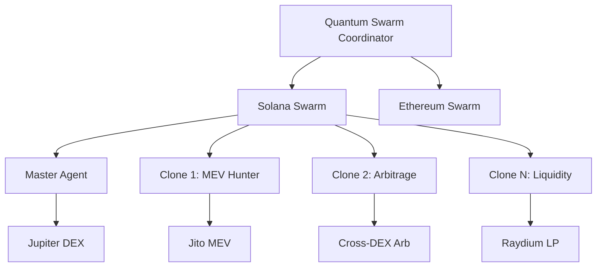

# 🌌 Quantum Swarm Trader

> Autonomous crypto trading system with fractal cloning technology. Grow $100 → $100K through swarm intelligence, MEV hunting, and cross-chain arbitrage.

[](https://python.org)
[](https://github.com/sendaifun/solana-agent-kit)
[](LICENSE)
[](https://github.com/aegntic/fractal-swarm)
[](https://github.com/aegntic/fractal-swarm/issues)
[](https://github.com/aegntic/fractal-swarm/network)
[](https://github.com/aegntic/fractal-swarm/graphs/contributors)

## 🚀 Features

- **🤖 Solana Agent Kit Integration** - 60+ automated DeFi actions
- **🧬 Fractal Clone System** - Self-replicating agents with behavioral mutations
- **⚡ Multi-Chain Support** - Solana, Ethereum, and MegaETH ready
- **📱 Mobile Dashboard** - Progressive Web App for iOS/Android
- **🖥️ Terminal UI** - Beautiful TUI for SSH management
- **🔄 Real-Time Updates** - WebSocket live data streaming

## ⚡ Quick Start

```bash
# Clone the repository
git clone https://github.com/your-username/quantum-swarm-trader.git
cd quantum-swarm-trader

# Install dependencies
pip install -r requirements.txt

# Copy environment variables
cp .env.example .env
# Edit .env with your Solana private key and API keys

# Run the demo
python3 example_usage.py

# Start trading (choose one)
python3 quantum_main.py start        # Full system
python3 ui/tui_dashboard.py          # Terminal UI only
```

## 🏗️ Architecture



## 🎯 Trading Strategy Phases

### Phase 1: MICRO ($100 → $1K)
- Jito MEV sandwich attacks
- Jupiter aggregator arbitrage  
- Failed transaction sniping
- **Timeline**: 5-7 days

### Phase 2: GROWTH ($1K → $10K)
- Cross-chain arbitrage
- Flash loan cascading
- Whale wallet copying
- **Timeline**: 20-30 days

### Phase 3: SCALE ($10K → $100K)
- Market making on DEXs
- Yield optimization
- Portfolio rebalancing
- **Timeline**: 60-90 days

## 🖥️ User Interfaces

### Terminal UI (TUI)
Perfect for server management via SSH:
```bash
python3 ui/tui_dashboard.py
```

### Web Dashboard
Modern web interface with mobile support:
```bash
# Backend
cd web/backend && uvicorn main:app

# Frontend
cd web/frontend && npm install && npm run dev
```

Access at `http://localhost:3000` and install as PWA on mobile.

## 📁 Project Structure

```
quantum-swarm-trader/
├── quantum_main.py           # Main CLI entry point
├── quantum_swarm_coordinator.py  # Core orchestrator
├── solana_agent_wrapper.py   # Solana Agent Kit integration
├── config_solana.py          # Solana configuration
├── ui/
│   └── tui_dashboard.py      # Terminal UI
├── web/
│   ├── backend/             # FastAPI backend
│   └── frontend/            # Next.js PWA
├── agents/                  # Trading agents
├── strategies/              # Trading strategies
└── docs/                    # Documentation
```

## 🔧 Configuration

Edit `.env` file with your keys:
```env
# Solana
SOLANA_PRIVATE_KEY=your_base58_key
SOLANA_RPC_URL=https://api.mainnet-beta.solana.com

# APIs
OPENAI_API_KEY=your_key  # For Solana Agent Kit
HELIUS_API_KEY=your_key  # Better RPC (optional)

# Redis
REDIS_HOST=localhost
REDIS_PORT=6379
```

## 🛡️ Safety Features

- **Stop Loss**: Automatic position closing
- **Daily Limits**: Maximum drawdown protection
- **Anti-Detection**: Behavioral randomization
- **Emergency Stop**: One-click shutdown
- **Atomic Locking**: Prevents clone collisions

## 📚 Documentation

- [Setup Guide](SETUP_GUIDE.md) - Detailed installation
- [Solana Integration](README_SOLANA.md) - Solana-specific features
- [UI Options](UI_COMPARISON.md) - Choosing the right interface
- [Mobile Setup](MOBILE_SETUP.md) - Mobile app configuration
- [Architecture](TECHNICAL_ARCHITECTURE.md) - System design

## 🤝 Contributing

1. Fork the repository
2. Create your feature branch (`git checkout -b feature/amazing`)
3. Commit changes (`git commit -m 'Add amazing feature'`)
4. Push to branch (`git push origin feature/amazing`)
5. Open a Pull Request

## ⚠️ Disclaimer

This software is for educational purposes. Cryptocurrency trading carries substantial risk. Only trade with funds you can afford to lose. We are not responsible for any losses incurred.

## 📄 License

MIT License - see [LICENSE](LICENSE) file for details.

## 🙏 Acknowledgments

- [Solana Agent Kit](https://github.com/sendaifun/solana-agent-kit) - DeFi automation
- [MegaETH](https://megaeth.com) - Real-time blockchain (coming soon)
- [Textual](https://github.com/Textualize/textual) - Beautiful TUIs

---

**Built with ❤️ for the DeFi community**