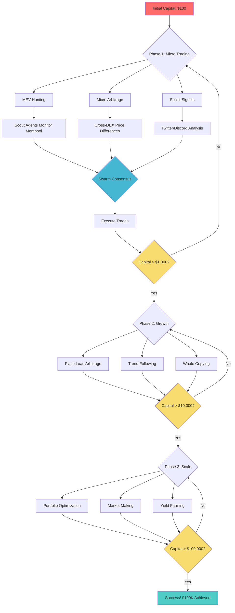

```mermaid
graph TD
    A[Initial Capital: $100] --> B{Phase 1: Micro Trading}
    B --> C[MEV Hunting]
    B --> D[Micro Arbitrage]
    B --> E[Social Signals]
    
    C --> F[Scout Agents Monitor Mempool]
    D --> G[Cross-DEX Price Differences]
    E --> H[Twitter/Discord Analysis]
    
    F --> I{Swarm Consensus}
    G --> I
    H --> I
    
    I --> J[Execute Trades]
    J --> K{Capital > $1,000?}
    
    K -->|No| B
    K -->|Yes| L{Phase 2: Growth}
    
    L --> M[Flash Loan Arbitrage]
    L --> N[Trend Following]
    L --> O[Whale Copying]
    
    M --> P{Capital > $10,000?}
    N --> P
    O --> P
    
    P -->|No| L
    P -->|Yes| Q{Phase 3: Scale}
    
    Q --> R[Portfolio Optimization]
    Q --> S[Market Making]
    Q --> T[Yield Farming]
    
    R --> U{Capital > $100,000?}
    S --> U
    T --> U
    
    U -->|No| Q
    U -->|Yes| V[Success! $100K Achieved]
    
    style A fill:#ff6b6b
    style V fill:#4ecdc4
    style I fill:#45b7d1
    style K fill:#f7dc6f
    style P fill:#f7dc6f
    style U fill:#f7dc6f
```